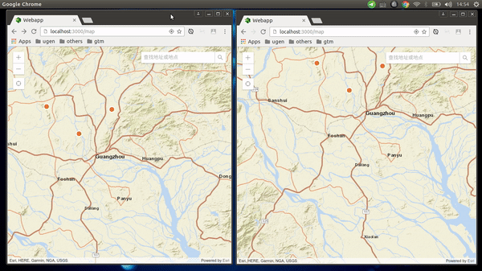

# Donor blood
A single page app with ArcGIS map using MEAN stack in a fullstack hackathon,its orignal requirements are [here](Assignment.md)

## Demo show


## Features
1. The pins are lazy loaded, only the pins that belong to the visible area of map are loaded.
2. If any pin changes (a user made change to his post or deleted it), The change should be visible real time to other users.

## Technologies(MEAN stack)
1. Strongloop(based on node.js and express.js), a REST API framework with micro service infrastructure
2. Mongodb, a schema-free NoSQL database
3. Socket.io, real-time bidirectional event-based communication
4. Angular 2, One front-end framework for Mobile & desktop.
5. Docker, transition to DevOps

## How to run
1. install node.js(^v6.10.1),mongodb(^2.6.10), and mongodb is running at localhost:27017
2. ```npm install -g @angular/cli@1.0.0```
3. ```git clone https://github.com/haxejs/donorblood```
4. ```cd donorblood/Code```
5. ```npm install```
6. apply a patch by ```cp patches/FireLoop.js node_modules/@mean-expert/loopback-component-realtime/dist/modules/FireLoop.js```
7. ```cd client``` then run ```npm install && ng build --env=demo```
8. ```cd ..```, start the server by ```npm start```
9. In browser, open http://localhost:3000/, you should can view a map
